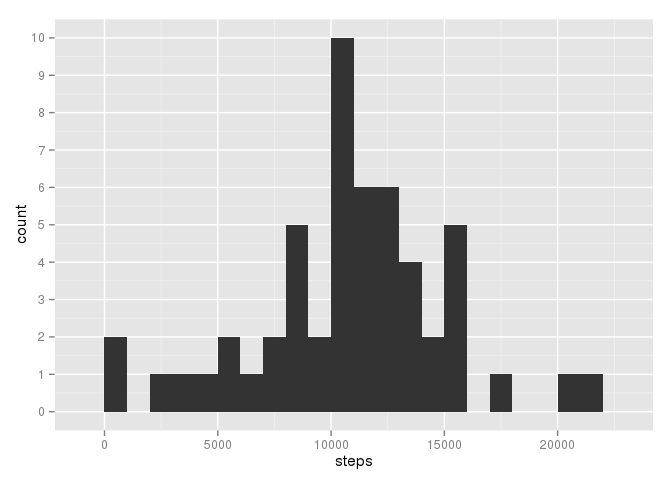
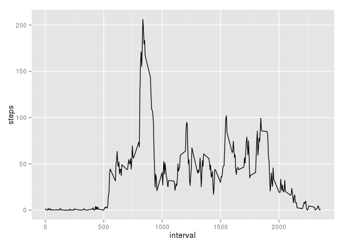
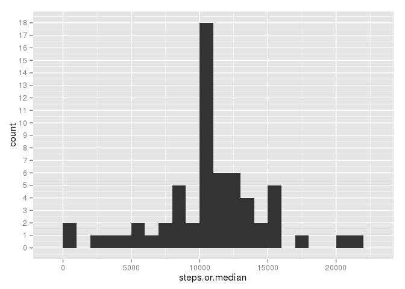
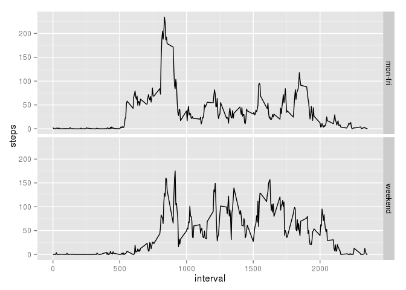

# Reproducible Research: Peer Assessment 1
Cezary Bartoszuk  
15 Nov 2015  


## Loading and preprocessing the data

1.  Unarchive and load the data.

    
    ```r
    unzip("activity.zip")
    activity <- read.csv("activity.csv")
    ```

1.  Take a look at the data:
    
    ```r
    str(activity)
    ```
    
    ```
    ## 'data.frame':	17568 obs. of  3 variables:
    ##  $ steps   : int  NA NA NA NA NA NA NA NA NA NA ...
    ##  $ date    : Factor w/ 61 levels "2012-10-01","2012-10-02",..: 1 1 1 1 1 1 1 1 1 1 ...
    ##  $ interval: int  0 5 10 15 20 25 30 35 40 45 ...
    ```
    Correct data formats. Columns `steps`, `interval` are `int` which
    is fine. However `date` was interpreted as a `factor`. Might be more
    efficient to work with `Date` objects.
    
    
    ```r
    activity$date <- as.Date(activity$date, "%Y-%m-%d")
    ```

## What is mean total number of steps taken per day?

1.  Compute total sum of steps per day.
    
    ```r
    steps.per.day <- aggregate(steps ~ date, data=activity, FUN=sum)
    ```

1.  Steps per day histogram
    
    ```r
    library(ggplot2)
    ggplot(steps.per.day, aes(x=steps)) +
      geom_histogram(binwidth=1000) +
      scale_y_continuous(breaks=0:12)
    ```
    
     

1.  Some statistics of steps per day, mean:
    
    ```r
    mean(steps.per.day$steps)
    ```
    
    ```
    ## [1] 10766.19
    ```
    
    and median:
    
    ```r
    median(steps.per.day$steps)
    ```
    
    ```
    ## [1] 10765
    ```
    
## What is the average daily activity pattern?

1.  Average steps across all days for each interval:
    
    ```r
    avg.steps <- aggregate(steps ~ interval, data=activity, FUN=mean)
    ```

1.  Line plot average step of each interval:
    
    ```r
    ggplot(avg.steps, aes(x=interval, y=steps)) +
      geom_line()
    ```
    
     
    
1.  Which interval holds the maximum average?
    
    ```r
    avg.steps[which.max(avg.steps$steps),]$interval
    ```
    
    ```
    ## [1] 835
    ```

## Imputing missing values

1.  The total number of missing values is;
    
    ```r
    sum(is.na(activity$steps))
    ```
    
    ```
    ## [1] 2304
    ```

1.  Use average for interval as missing value. Check that all was filled.
    
    ```r
    activity$steps.or.median <- activity$steps
    na.rows <- is.na(activity$steps)
    na.intervals <- activity$interval[na.rows]
    activity$steps.or.median[na.rows] <-
      avg.steps$steps[match(na.intervals, avg.steps$interval)]
    sum(is.na(activity$steps.or.median))
    ```
    
    ```
    ## [1] 0
    ```

1.  Steps per day histogram for filled data
    
    ```r
    steps.per.day.filled <- aggregate(steps.or.median ~ date,
                                      data=activity,
                                      FUN=sum)
    ggplot(steps.per.day.filled, aes(x=steps.or.median)) +
      geom_histogram(binwidth=1000) +
      scale_y_continuous(breaks=0:25)
    ```
    
     

1.  Some statistics of steps per day, mean:
    
    ```r
    mean(steps.per.day.filled$steps.or.median)
    ```
    
    ```
    ## [1] 10766.19
    ```
    Mean value did not change as mean of every interval (being the same
    size) did not change. We swapped NAs in each interval for mean of
    that interval.
    
    Median:
    
    ```r
    median(steps.per.day.filled$steps.or.median)
    ```
    
    ```
    ## [1] 10766.19
    ```
    Looking at the histogram, there were lots of missing values
    during peak time. Median changed because we added a lot of values
    in the middle of distribution.
    
## Are there differences in activity patterns between weekdays and weekends?

1.  Consider weekends:
    
    ```r
    weekend <- c("Saturday", "Sunday")
    activity$is.weekend <-
      factor(ifelse(weekdays(activity$date) %in% weekend, "weekend", "mon-fri"))
    ggplot(activity, aes(x=interval, y=steps)) +
      stat_summary(fun.y = "mean", geom = "line") +
      facet_grid(is.weekend ~ .)
    ```
    
    ```
    ## Warning: Removed 1728 rows containing missing values (stat_summary).
    ```
    
    ```
    ## Warning: Removed 576 rows containing missing values (stat_summary).
    ```
    
     
